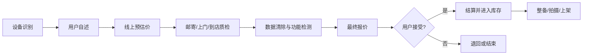
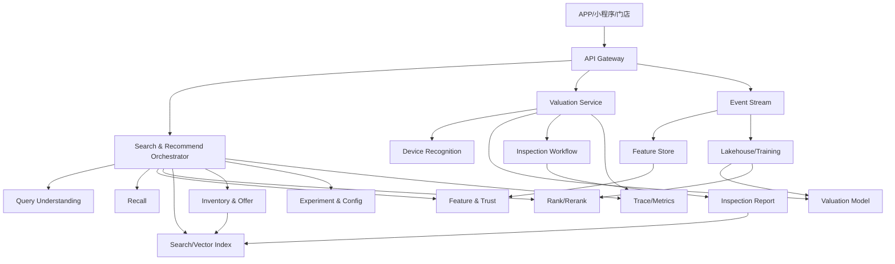

# 13 墨圆拟真业务场景：墨圆质选、回收、寄卖与搜推

> **Legacy 教材**：本章属于早期搜索推荐课程与二手案例，不代表墨圆智选当前产品主线；当前架构见 [Moyuan SAR Agent V2](../code/agent-control-plane/README.md)。

## 1. 案例边界

“墨圆电商平台”是本课程自定义的教学品牌。本章用合成商品、会话和规则训练二手电商的产品分析与技术设计能力。

必须区分：

- **Legacy 主线设定**：墨圆质选二手 iPhone 的需求澄清、搜索、比较、确认和保存候选闭环。
- **可选扩展**：回收估价、寄卖、门店和仓储履约，仅用于课程加练。
- **事实边界**：平台能力、流程、商品、价格、库存、规则、权重和 SLA 均为教学设计或合成数据。

本章不声称这些能力已经在真实平台上线，也不代表任何企业的生产实现。

## 2. 课程业务设定

| 课程设定 | 对教学设计的启发 |
|---|---|
| “墨圆质选”模拟一物一检，按品类记录成色、功能和质检结论 | 商品不是标准 SKU，需要把质检报告建模为可搜索、可排序、可追溯的数据 |
| 质选商品携带合成的退货和质保字段 | 售后承诺属于商品决策特征，也是必须准确过滤的履约契约 |
| 回收/保卖估价需要品牌、型号、年限、外观、功能等信息 | 卖侧需要独立的设备识别、预估价、质检复价和报价接受链路 |
| 寄卖扩展包含取件、质检、拍摄、存储、物流和售后 | 寄卖不是普通“发布商品”，而是一条平台履约供应链 |
| 主线采用有平台服务的 C2B2C 教学形态 | 搜推需要同时建模商品、服务承诺和履约风险 |
| 门店、质检中心和上门回收作为扩展设定 | 可练习线上流量、门店库存、服务覆盖、物流时效和循环价值 |

课程允许使用 Apple 等品牌和型号帮助检索教学，但商品价格、库存、成色、电池、维修史、质保与平台关系均为合成，不代表真实在售或品牌授权。

## 3. 为什么二手搜推更难

传统新品电商中，同一 SKU 的属性、质量和售后比较稳定；二手商品是一物一况：

```text
同一型号
  + 不同成色
  + 不同电池健康
  + 不同拆修历史
  + 不同配件完整度
  + 不同质保与退货承诺
  + 不同供给渠道
  + 不同仓库/门店位置
  = 不同的购买价值和履约风险
```

因此，相关性不是唯一目标。二手搜索至少同时优化：

1. 型号和规格匹配。
2. 质检透明度与可信度。
3. 成色、功能和维修情况。
4. 价格与剩余价值。
5. 质保、退货和发货时效。
6. 库存真实性与可履约性。
7. 平台库存周转和供需平衡。

## 4. 领域模型

### 4.1 商品与供给

教学代码在 `Product` 中增加：

```python
service_mode
inspection_status
inspection_grade
warranty_days
return_window_days
battery_health
inspection_findings
```

`service_mode` 用来解释供给如何进入平台：

| 教学值 | 业务含义 |
|---|---|
| `platform_inspected` | 已完成平台质检并进入墨圆质选卖场 |
| `recycle_inventory` | 由回收链路进入平台库存 |
| `consignment` | 用户委托平台寄卖 |
| `store_inventory` | 由线下门店承接或销售的库存 |

这些枚举是教学抽象，不声称与真实内部枚举一致。

### 4.2 质检报告

生产级 `InspectionReport` 应独立建模：

```text
report_id
product_id
inspection_standard_version
inspection_station
inspector
started_at/completed_at
appearance_findings[]
functional_findings[]
authenticity_findings[]
repair_and_part_findings[]
battery_and_performance
grade
status
evidence[]
signature
```

为什么不能只放一个 `quality_score`：

- 用户需要查看具体瑕疵，而不是一个黑盒分。
- 不同品类的质检维度不同。
- 报告更新必须可追溯、可审计。
- 排序只能消费稳定特征，不能替代报告本身。
- 售后争议需要还原下单时看到的报告版本。

### 4.3 服务承诺

售后承诺要成为结构化契约：

```text
WarrantyPolicy
ReturnPolicy
ShippingPromise
RepairPolicy
```

不要只把“质保”“包邮”写进商品标题。搜索过滤、下单校验、客服和售后需要读取同一版本的规则。

## 5. 买侧：墨圆质选商品搜索

### 5.1 用户任务

一个典型请求不是简单的“iPhone”：

> 想买 4000 元以内的 iPhone，电池健康至少 85%，有质保，不要严重维修机。

课程命令：

```bash
cd moyuan-sar-agent/code
.venv/bin/shoprec search "iphone" \
  --category "手机" \
  --inspection-grade A \
  --inspection-grade B \
  --min-battery-health 85 \
  --warranty-required \
  --max-price 4000 \
  --view explain
```

FILTER 阶段会输出：

```text
out_of_stock
inspection_not_passed
inspection_grade_mismatch
battery_health_below_min
warranty_unavailable
above_max_price
```

顺序原则：

1. 先执行不可绕过的库存和质检状态校验。
2. 再执行用户明确筛选。
3. 最后才进入特征、模型和重排。

不合格质检商品不能因为 CTR 高而进入排序。

### 5.2 信任特征

教学版增加：

```text
trust =
    inspection status
  + inspection grade
  + warranty coverage
  + return coverage
  - disclosed finding penalty
```

`trust` 是可解释的排序特征，不是“官方认证”的真伪判断器。生产中还需要：

- 报告完整度。
- 质检标准版本。
- 质检站质量指标。
- 报告与实物差异率。
- 类目级售后与退货风险。
- 欺诈和异常库存信号。

### 5.3 排序目标

墨圆质选商品搜索可以使用：

```text
utility =
    relevance
  + intent_match
  + calibrated_ctr
  + calibrated_cvr
  + trust
  + value_for_money
  + freshness
  - return_risk
  - fulfillment_risk
```

这里存在真实冲突：

- 最便宜不等于最值得买。
- 成色最好不等于性价比最高。
- CTR 高不等于售后风险低。
- 新入库商品需要探索，但不能压过强相关型号。

## 6. 卖侧：回收与预估价

### 6.1 业务链路

在课程的回收扩展设定中，估价使用品牌、型号、年限、外观和功能等信息。教学链路抽象为：



最重要的契约是：

```text
线上预估价 != 最终成交价
最终价格依赖实物质检
```

课程命令：

```bash
.venv/bin/shoprec value-device \
  --brand Apple \
  --model "iPhone 13" \
  --storage 128 \
  --age-months 36 \
  --condition-grade B \
  --battery-health 90 \
  --inspection-method door
```

输出包括：

- 预估价区间和中位值。
- 参考价来源：精确机型、类目基准或通用兜底。
- 年限、成色、电池、容量和故障因子。
- 风险标志。
- 最终价需要质检的明确声明。
- 下一步履约流程。

`functional_issues` 是集合语义，同一故障不能重复提交，避免重复乘以同一个折损因子。

### 6.2 为什么必须返回区间

线上自述存在不确定性：

- 用户对成色等级理解不同。
- 维修、进水和非原装件不一定可见。
- 电池和功能状态可能测量不准。
- 型号、区域版本和容量可能识别错误。

返回单点价格会制造错误确定性。生产系统应提供：

```text
估价区间
关键假设
影响最大的因素
有效期
质检复价规则
价格变化解释
```

### 6.3 估价模型分层

```text
规则基线
  -> 可解释 GBDT/回归模型
  -> 图像与文本多模态成色识别
  -> 实时供需和库存周转修正
  -> 风险与人工审核
```

训练标签不能只使用最终回收价，因为最终价同时受议价、活动、库存和人工判断影响。需要区分：

- 设备客观状态。
- 市场公允价值。
- 平台目标收购价。
- 最终实际成交价。

## 7. 寄卖业务

在课程的寄卖扩展设定中，链路包含取件、质检、拍摄、存储、物流和售后：


寄卖搜推特有问题：

- 同一用户可能一次寄卖多个商品。
- 定价权和建议价之间需要记录版本。
- 长期未售商品需要降价建议和再分发。
- 高值商品要控制曝光人群和欺诈风险。
- 商品售出、撤回、复检时要快速更新索引。

课程搜索：

```bash
.venv/bin/shoprec search "笔记本" \
  --service-mode consignment \
  --warranty-required \
  --view explain
```

## 8. 推荐与库存经营

普通推荐只关心用户兴趣还不够。平台持有或承接履约的非标库存还要考虑：

```text
用户价值
  + 信任与质量
  + 库存周转
  + 供需缺口
  + 售后风险
  + 门店/仓库履约成本
  + 循环价值
```

### 8.1 买家推荐

- 浏览 iPhone 后推荐同型号不同成色和价格带。
- 已购买手机后降低同类整机，增加适配配件。
- 高信任偏好用户优先展示报告完整、售后明确的商品。
- 价格敏感用户展示性价比，但不降低硬质检门槛。

### 8.2 卖家触达

- 某型号需求高、库存低时，向合适用户提示回收估价。
- 某类库存过剩时降低收购激励或调整估价。
- 换新周期到达时触发以旧换新或回收提醒。

卖家触达必须遵守授权、隐私和营销退订要求。

### 8.3 库存老化

非标库存不能无限等待：

```text
inventory_age
  -> 降价建议
  -> 推荐探索配额
  -> 门店调拨
  -> 渠道转换
  -> 退出或再处置
```

不能只用提高曝光解决库存问题，否则会伤害相关性和用户信任。

## 9. 门店、仓库与线上流量

在门店与仓储扩展设定中，教学架构需要统一：

```text
线上商品可售库存
门店现货
在途回收商品
待质检商品
待上架商品
售后锁定商品
```

搜索索引中的 `stock=1` 只能表示简化结果。生产中应使用库存状态机：

```text
RECEIVED
  -> INSPECTING
  -> PASSED/REJECTED
  -> READY_TO_LIST
  -> ON_SALE
  -> RESERVED
  -> SOLD
  -> RETURNED
  -> REINSPECTING
```

索引延迟导致重复售卖是高优先级事故，因此下单前必须再次调用库存与价格权威服务。

## 10. 教学参考架构



这是课程参考架构，不代表任何已经上线的墨圆生产实现。

## 11. 关键指标

### 买侧

- 搜索成功率、零结果率、Query 改写接受率。
- 质检报告打开率和阅读完成率。
- 搜索点击率、详情到下单转化率。
- 按质检等级、成色、渠道拆分的转化率。
- 退货率、质保报修率、报告与实物差异率。

### 卖侧

- 估价完成率。
- 预估价到质检履约率。
- 最终报价接受率。
- 预估价与最终价偏差分布。
- 质检拒绝率和原因分布。
- 从回收到上架的周期。

### 供给与经营

- 库存周转天数。
- 各型号供需比。
- 调价次数和售出概率。
- 仓店履约时效。
- 售后成本和净贡献。

指标必须按品类、品牌、型号、价格带、质检等级、渠道和实验版本切片。

## 12. 风险与合规

### 12.1 质检风险

- 报告与实物不一致。
- 质检标准版本漂移。
- 维修和非原装件漏检。
- 高值商品鉴真错误。

### 12.2 价格风险

- 估价过高造成库存亏损。
- 估价过低造成用户流失。
- 活动补贴污染模型标签。
- 市场价格突变导致报价失效。

### 12.3 隐私与安全

回收设备可能包含个人数据。课程只模拟估价，不处理真实设备；生产系统还需要：

- 明确的数据清除流程和证明。
- 设备标识、身份和支付数据最小化。
- 权限、审计和保留期限。
- 欺诈、盗抢和异常设备识别。
- 用户授权与营销退出。

## 13. 代码映射

| 业务能力 | 教学实现 |
|---|---|
| 墨圆质选属性与报告摘要 | `models.py` 的 Product/`service` |
| 质检、电池、质保筛选 | `service.py`、`search.py` |
| 信任排序特征 | `ranking.py::trust_score` |
| 回收预估价 | `valuation.py` |
| CLI 估价 | `shoprec value-device` |
| HTTP 估价 | `POST /api/valuation` |
| 一键业务导览 | `scripts/quick-moyuan-case.sh` |
| 可重复业务案例 | `scenarios/moyuan-secondhand-business-case.json` |

一键运行：

```bash
cd moyuan-sar-agent/code
bash scripts/quick-moyuan-case.sh
```

## 14. 业务实验

### 实验 A：信任权重

把 `search_rank` 的 `trust` 权重提高，观察：

- A/B 质检等级商品位置。
- 有瑕疵商品位置。
- 相关性是否受到过大损失。

### 实验 B：电池门槛

对手机场景设置 `min_battery_health=85`，比较：

- 候选减少量。
- 转化率预期。
- 价格带变化。
- 低电池商品是否应该进入低价专区，而不是直接退出。

### 实验 C：估价偏差

批量构造不同成色、电池和故障组合，计算：

```text
quote_error = final_inspection_price - online_estimate
```

按模型、成色和用户自述准确度切片。

### 实验 D：库存老化

增加 `inventory_age_days`，设计：

- 排序轻量探索。
- 降价建议。
- 门店调拨。
- 退出策略。

不要直接把库存年龄变成无限加分。

## 15. 90 分钟授课安排

| 时间 | 内容 | 产出 |
|---|---|---|
| 0-10 分钟 | 课程设定与事实边界 | 区分主线、扩展和生产事实 |
| 10-25 分钟 | 墨圆质选商品模型 | 画出质检报告和服务契约 |
| 25-40 分钟 | iPhone 搜索演示 | 解释过滤、trust 和排序 |
| 40-55 分钟 | 回收估价演示 | 解释区间、复价和风险 |
| 55-65 分钟 | 寄卖与库存状态机 | 画出供应链 |
| 65-75 分钟 | 推荐和库存经营 | 设计多目标 |
| 75-85 分钟 | 场景回放与故障实验 | 修改断言并回归 |
| 85-90 分钟 | 复盘 | 写出系统边界 |

## 16. 复习问题

1. 为什么质检状态必须在排序前硬过滤？
2. 为什么质检报告不能只存一个分数？
3. 预估价和最终价之间应有哪些可解释字段？
4. 为什么低价、成色和信任不能简单线性等价？
5. 寄卖商品长期未售时，搜索推荐能做什么、不能做什么？
6. 门店库存怎样与线上搜索索引保持一致？
7. 如何验证提高 `trust` 权重没有破坏相关性？
8. 哪些内容属于主线设定，哪些只是可选扩展或生产推演？
