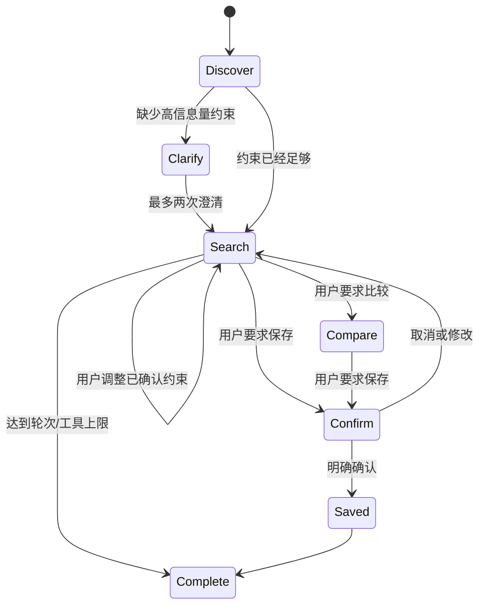

# 14 搜推 Agent 的边界、工具与工作流

> **Legacy 教材**：本章描述 V1 二手购买决策 Agent，不代表墨圆智选当前多 Agent 产品主线；当前架构见 [Moyuan SAR Agent V2](../code/agent-control-plane/README.md)。

本课程的主线不是一个泛化的“墨圆 Agent”，而是一个明确的**购买决策搜推 Agent**。墨圆只是教学品牌，Agent 的专业能力始终是：理解购买需求、调用搜索与推荐能力、基于证据比较候选、在确认后保存清单和反馈。

## 1. 为什么先定边界

如果同时做客服、卖家估价、下单、支付、售后和运营诊断，Agent 很快会变成无法评测的万能聊天入口。V1 只处理二手 iPhone，完成标准是：

- 最多返回 3 个候选；
- 每个事实都能追溯到商品工具或版本化知识卡；
- 明确区分硬约束、偏好和假设；
- 无结果时只建议最小放宽，不自动应用；
- 用户明确确认后才保存 1–3 个候选；
- 不下单、不支付、不读取其他用户数据、不调用卖家回收估价。

## 2. 三层职责

| 层 | 负责 | 不负责 |
|---|---|---|
| Agent 工作流 | 会话状态、约束、工具白名单、确认、证据、降级、Trace | Provider 选择和密钥 |
| 搜推业务 API | 搜索、推荐、比较、反馈、清单写入 | 自由对话和跨工具编排 |
| ModelPort | 认证、逻辑模型别名、路由、配额、Provider 重试、用量证据 | 业务约束、用户确认、商品真伪判断 |

代码对应关系：

```text
shoprec_agent.py   状态机与有界编排
agent_tools.py     业务工具契约
model_port.py      ModelPort OpenAI-compatible Adapter
service.py         已有搜索、推荐、估价和反馈服务
```

购买 Agent 故意不暴露 `value_device`。买家侧价格解释来自同型号、容量和成色相近的合成挂牌商品中位价，不能拿卖家回收价替代零售决策。

## 3. 有界状态机



硬上限是 6 轮、5 次业务工具调用、每轮最多一个工具。ModelPort 请求固定 `parallel_tool_calls=false`。即使模型返回更宽的预算、更多候选或缺失条件，最终业务参数仍由确定性需求状态生成。

## 4. 工具契约

| 工具 | 类型 | 关键保护 |
|---|---|---|
| `search_products` | 只读 | iPhone、墨圆质选、质检通过、硬约束过滤 |
| `recommend_products` | 只读 | 用户作用域、过滤不可信商品内容 |
| `compare_products` | 只读 | 最多 3 个 ID，只用目录事实和可比挂牌价 |
| `suggest_relaxations` | 只读 | 只返回建议，`applied=false` |
| `record_feedback` | 写 | 只有用户明确表达 click/dislike 才执行 |
| `save_shortlist` | 写 | 明确确认、1–3 个 ID、幂等键、用户/会话隔离 |

`AgentToolRegistry` 会拒绝未知字段、缺字段、错误 JSON 类型、越界数字、无确认写入和未知商品 ID。不要把这些约束只写在 Prompt 中。

## 5. 澄清策略

Agent 每轮只问一个高信息量问题，最多两次：

1. 没有预算时先问最高预算；
2. 有预算但风险偏好未知时，确认是否必须质保、是否接受拆修；
3. 约束足够就尽早搜索，不把对话拖成问卷。

用户说“预算不超过 3500”“必须质保”“不接受维修”时，对应字段进入 `hard_fields`。硬约束只能由用户后续明确修改。

## 6. 运行第一个完整闭环

```bash
cd moyuan-sar-agent/code
PYTHONPATH=src:. python3 -m shoprec.cli agent \
  --message "预算不超过3600元，128G以上，电池至少87，必须质保，不接受维修" \
  --message "比较前三个" \
  --message "保存前两个" \
  --message "确认保存"
```

第三轮只生成待确认操作，不调用写工具；第四轮才真正保存。用 `--full` 可检查每轮状态、工具、证据、模型路由和确认字段。

## 7. 本章验收

- 能解释为什么这是“搜推 Agent”，而不是品牌万能 Agent；
- 能指出模型参数为什么不能直接成为业务硬约束；
- 能证明未确认前 shortlist store 为空；
- 能解释 Agent 重试与 ModelPort Provider 重试为什么属于不同层。

对应实验：[Lab 13](../code/labs/lab13-agent-boundaries.md)。
