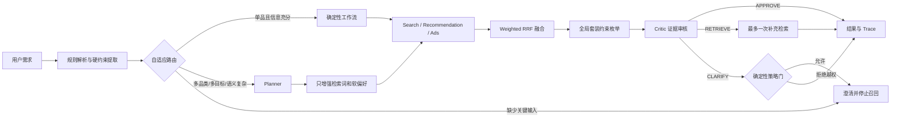

# BuySense 3C 智能购买决策系统：架构复审与面试材料

## 1. 项目定位

BuySense 面向 3C 数码购买决策，不是通用聊天机器人。用户给出预算、品类、用途、是否接受广告和是否需要套装后，系统要在可审计的前提下完成多路召回、融合排序、套装组合、证据审核和结果呈现。

核心原则是：工作流与 Agent 并列存在，生产请求只选择一条执行路径；只有离线评测才让同一问句分别运行两条路径用于比较。

## 2. 为什么采用混合架构

### 不全部使用固定工作流

固定工作流适合预算过滤、品类过滤、广告策略、兼容性校验和组合优化，但难以稳定处理多目标表达、别名、模糊用途和补充检索词。

### 不全部交给 Agent

LLM 会增加延迟、token 成本和不确定性，也可能把软偏好误判为必须澄清的硬条件。因此预算、品类、广告和兼容性永远由 Java 确定性代码控制；Planner 只能增加软信息，Critic 的结论还要经过策略门。

### 生产与评测的区别

- 生产：`ExecutionRouter` 每个请求只选择 `WORKFLOW` 或 `HYBRID`。
- 离线：`LiveDecisionBenchmarkTest` 强制同一批问句分别走两条路径，用于校准路由阈值。
- 降级：ModelPort 不可用或模型输出不是 JSON 时，系统回退到确定性链路，不修改用户硬约束。

## 3. 关键工程点

- `IntentParser` 记录约束来源和强度；模型改写只能扩充检索词、用途和软偏好。
- `ExecutionRouter` 根据品类数、套装、软目标数、模糊表达和缺失信息选择路径。
- `DecisionEngine` 并行组织 Search、Recommendation、Ads 候选，以 Weighted RRF 融合并限制前三位广告数。
- 套装不是逐项贪心选择，而是在预算和兼容性约束下做有界全局枚举。
- `RunService` 提供异步 Run、幂等创建、取消、SSE 事件回放、状态恢复和购物车草案确认边界。
- Critic 只可给出 `APPROVE`、`RETRIEVE`、`CLARIFY`；补充检索最多一次，澄清建议必须通过确定性策略门。

## 4. 测试与数据口径

### 人工业务回归

- 40 条人工编写用例，不从商品字段自动生成标签。
- 覆盖单品工作流、复杂混合链路、套装、拒绝广告和必须澄清五类场景。
- 当前门禁结果：全部通过，硬约束违规 0，广告策略违规 0。
- 商品目录是 13 个 3C SPU 的本地参考快照；名称和规格用于演示，价格、库存和分数不声明为实时电商数据。

### 真实 DeepSeek 双轨基准

2026-08-09 在同一台开发机上，对 4 条复杂业务问句分别强制运行工作流和混合链路。ModelPort 实际调用 DeepSeek，非 Mock。

| 指标 | 工作流 | 混合链路 |
|---|---:|---:|
| 完成率 | 100% | 100% |
| Category Recall@10 | 100% | 100% |
| 硬约束通过率 | 100% | 100% |
| 模型调用数 | 0 | 8 |
| 模型降级数 | 0 | 0 |
| Token 总量 | 0 | 2282 |
| P50 延迟 | 0 ms | 2641 ms |
| P95 延迟 | 2 ms | 2767 ms |

样本量只有 4，数据用于架构校准，不代表线上推荐质量。它证明了复杂链路可用，也证明简单请求没有必要支付模型成本。

## 5. 方案复审结论

保留自适应混合架构。全工作流会削弱复杂语义处理；全 Agent 会把确定性约束交给概率模型。当前边界更适合面试和实际落地：LLM 负责规划、检索增强和证据复核，Java 负责硬约束、状态、策略和失败降级。

尚未声称完成的能力包括真实库存/价格接入、线上行为特征、学习排序模型、支付执行和生产流量压测。这些是后续演进项，不应写成已上线能力。

## 6. 面试高频追问

### 为什么不用一个大 Prompt 直接推荐？

因为预算、广告和兼容性需要可复现、可测试、可否决。大 Prompt 难以证明没有漏约束，也无法稳定回放。

### Router 会不会也是一堆规则？

目前是可解释的低成本路由基线。规则来自业务复杂度，不参与商品决策；阈值通过离线双轨数据校准。未来可以用历史任务成功率训练分类器，但仍保留规则兜底。

### LLM 改写如何防止篡改预算？

原始预算、必选品类、广告偏好和套装标记保存在独立字段中。`enrich` 只合并检索文本和软约束，模型结果无法覆盖硬字段。

### 为什么 Critic 不能直接决定澄清？

真实基准中模型曾把“拍照和游戏都要”误判为必须追问。现在 Critic 只能建议，策略门仅在缺少关键输入或无可行结果时允许阻断。

### 为什么套装不用贪心？

逐品类选 Top1 可能总价超预算或接口不兼容。有界枚举在当前候选规模下能直接求满足预算、兼容性和总分的全局方案，并保留备选组合。

### 怎样替换成运动器材业务？

保留 Run、路由、RRF、模型桥接和评测框架，替换 `CommerceDomainPolicy` 实现、品类词典、目录字段、兼容规则和业务用例即可。
