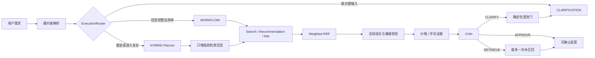

# BuySense 多领域智能购买决策平台：架构复审与面试材料

## 1. 项目定位

BuySense 以 3C 数码购买决策为主业务：用户给出预算、品类、用途、品牌偏好、广告偏好和套装需求后，系统完成需求解析、多路召回、融合排序、组合求解、证据核验和可确认购物车草案。户外露营包用于证明同一编排内核可以替换领域资产，不把项目包装成支持任意商品模型的“万能 Agent”。

本次融合保留了原 Java 版本的自适应路由、硬约束求解和可恢复 Run，并吸收老师新版上游的 Domain Pack、Capability / Workflow Registry、多来源零售 Provider 与来源健康治理：

- `normal-3c-v1`：手机、耳机、充电器及电脑外设的主业务包；
- `outdoor-camping-v1`：灶具、气罐、炊具等高海拔露营套装验证包；
- `commerce-decision-v1`：两者复用的版本化工作流；
- `commerce-bounded-v1`：包含 10 项能力和有界委派关系的能力画像。

## 2. 为什么不是纯工作流，也不是全 Agent

工作流和 Agent 是按任务特征选择的两条执行形态，不存在“Agent 一定更高级”。生产请求只运行一条路径：

- `WORKFLOW`：预算、品类、广告和兼容性由确定性 Java 服务执行，适合信息完整的单品请求。
- `HYBRID`：Planner 处理别名、多目标、模糊用途和检索词扩展；Critic 复核方案，但二者都不能覆盖用户硬约束。
- `CLARIFICATION`：缺预算或目标品类等关键信息时，在召回前停止并只提出一个高价值问题。
- `fallback`：模型超时、协议错误或非结构化输出时回到确定性链路，不把模型故障传播成越权决策。

## 3. 四个可追问的工程点

### 3.1 版本化领域与有界编排

Domain Pack 只承载品类、同义词、用途、品牌、目录、评论和兼容图；稳定内核承载 Run、路由、搜广推、组合优化和安全策略。Capability Registry 注册 10 项能力，Workflow Registry 显式声明委派边，未登记的 `source -> target` 在执行前被拒绝。这样新增同合同的零售垂类无需把行业词散落到核心代码，但新增角色、币种或商品合同仍需升级工作流版本。

### 3.2 搜广推融合与全局组合

Search、Recommendation、Ads 原始分数不可直接横向比较，因此先按通道排名执行 Weighted RRF，再做资格和策略校验。拒绝广告只关闭 Ads 通道，不错误删除自然搜索命中的同一商品；前三位广告数量、预算、品类和库存由确定性层控制。套装不用逐品类 Top1 贪心，而是在有界候选空间枚举组合，同时满足总预算、品类覆盖和 connector / protocol 兼容规则。

### 3.3 外部数据可信边界

Catalog、Review、Pricing 通过独立 HTTP 契约接入。客户端验证 Bearer 鉴权、来源指纹、版本一致性、Content-Type、响应体上限、重复 JSON 键、重复 SPU / SKU / Offer、评论结果与缺失 ID 的完整分区，以及报价 ID 集合与请求集合完全一致。远端报价过滤后会重新检查默认决策链库存；失败默认关闭，只有显式开启 fallback 才使用本地快照，并在健康接口标记 `degraded`、错误码和计数，避免把本地样本伪装成远端实时数据。

### 3.4 Run、会话与确认安全

服务端签发会话身份；Run、取消、SSE 和确认都校验同会话所有权，跨会话统一表现为资源不存在。幂等键不仅复用 Run，还绑定原始请求、Domain Pack 与工作流，防止同键异义；并发竞争分支同样执行请求一致性检查。确认必须绑定原提案 Run、商品集合和金额指纹，失败后可使用新的尝试键重试；系统只生成购物车草案，始终保持 `paymentAuthorized=false`。

## 4. 验证与数据口径

| 层级 | 结果 | 口径 |
|---|---:|---|
| Java 单元/集成/合同测试 | 34 条，0 失败，1 条跳过 | 跳过项是无凭证时的真实模型基准；包含远端 Provider 成功、降级、脏数据拒绝和会话安全 |
| 人工业务回归 | 40 条，全部质量门通过 | 人工编写 Query；覆盖路由、任务完成、澄清、套装、拒绝广告，硬约束与广告违规为 0 |
| 固定合成检索基准 | 120 Query / 1,200 SPU | Recall@10 95.83%，NDCG@10 99.57%，P95 1.075 ms，硬过滤/广告违规 0；标签由目录属性生成，不是人工金标 |
| TypeScript 控制面 | 82 条测试 + 15 条评测通过 | 15 条为确定性 Replay 场景，不冒充真实模型效果 |
| Python 数据面 | 152 条测试通过 | 覆盖双 Domain Pack、零售数据端口、Shopify 适配和安全路径 |
| Playwright E2E | 4/4 通过 | 覆盖完整决策、数据源降级展示、露营包审计、确认失败后刷新重试 |

所有结果均来自 2026-08-13 本地回归。当前没有可用 Shopify 凭证，因此只读 Shopify canary 明确跳过；普通 `mvn test` 也会跳过真实模型基准。简历不使用缺少原始报告的 LLM Token/延迟数字。

## 5. 本次融合相对旧版的升级

| 旧版边界 | 融合后 |
|---|---|
| 3C 词表与目录直接绑定单一实现 | 2 个版本化 Domain Pack，共用编排与 UI |
| 固定链路为主，模型只做意图判断 | 按复杂度单路由 CLARIFICATION / WORKFLOW / HYBRID |
| 搜广推候选后按固定步骤处理 | Capability / Workflow Registry 显式约束 10 项能力及委派 |
| 本地目录为主要数据源 | Catalog / Review / Pricing 可插拔 Provider，来源与 fallback 可审计 |
| 推荐结果与执行边界较弱 | 会话隔离、请求绑定幂等、精确提案确认、支付禁用 |
| 跨平台 E2E 依赖环境中的 `bash` | Node 启动器在 Windows 显式使用 Git Bash并自动回收进程树 |

## 6. Grilling 后保留的边界

- 不采用“所有请求都交给 Agent”：硬约束和可复现求解留在确定性层。
- 不为了展示 MCP 把进程内稳定能力远程化：当前 Provider 用 HTTP 合同解决真实数据边界；跨进程工具生态有需求时再引入 MCP。
- 不使用 RL 自动生成工作流：当前业务样本不足以形成可靠训练与对照，成本高于收益。
- 不声称线上库存、转化率或交易能力：目录是参考快照，远端 Provider 是合同与本地 Mock 验证，支付明确禁用。

## 7. 面试高频追问

### 为什么 RRF 后仍要业务规则？

RRF 只融合不同通道的排名，不理解预算、广告治理、库存和兼容性；这些决定候选是否有资格进入结果，必须由确定性 Policy Gate 执行。

### 为什么套装不用贪心？

逐品类 Top1 可能总价超预算或接口不兼容。有界全局枚举在当前候选规模下可得到满足全部硬约束的最高分组合，并保留可解释备选。

### 为什么 Review 可以缺失，Pricing 不可以缺失？

评论证据允许显式返回 `missing_product_ids`，由 Critic 判断证据是否足够；价格直接影响金额和库存，报价响应必须对每个请求 Offer 精确分区，不能静默缺失或混入未知 ID。

### 怎样替换成运动器材？

若仍使用 CNY 报价和现有 connector/protocol 兼容语义，可新增版本化 Domain Pack；若需要尺码、场地、租赁或多币种等新合同，应升级公共 Schema 与 Workflow，而不是在 manifest 中偷加字段。