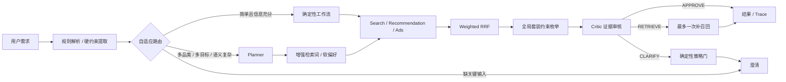

# BuySense 3C 智能购买决策系统：架构复审与面试材料

## 1. 项目定位

BuySense 面向 3C 数码购买决策。用户给出预算、品类、用途、广告偏好与套装需求后，系统在可审计边界内完成多路召回、融合排序、套装组合、证据审核和购物车草案生成。

核心原则是工作流与 Agent 按任务复杂度协作：生产请求只选择一条执行路径；离线评测才让同一问句分别运行两条路径，用于校准路由阈值。

## 2. 为什么采用混合架构

固定工作流适合预算过滤、品类过滤、广告策略、兼容性校验和组合优化；Planner 适合处理多目标表达、别名、模糊用途和检索词扩展。预算、品类、广告和兼容性始终由 Java 控制，模型只增强软信息，Critic 的建议还需经过策略门。

- 生产：`ExecutionRouter` 每个请求只选择 WORKFLOW 或 HYBRID。
- 离线：同一批复杂问句双轨运行，用结果与成本校准路由阈值。
- 降级：模型超时或非 JSON 输出时回退确定性链路，不改变用户硬约束。

## 3. 四个可追问的工程点

### 自适应执行

`ExecutionRouter` 根据品类数、套装、多目标、模糊表达和缺失信息选择路径。它只决定执行复杂度，不直接决定商品，因此可独立评测和回放。

### 搜广推与套装求解

Search、Recommendation、Ads 形成多路候选，Weighted RRF 避免直接比较不同召回源的原始分数；前三位广告保护与硬过滤在融合后执行。多品类套装采用有界全局枚举，同时满足预算、品类覆盖和兼容性，避免逐项 Top1 的局部最优。

### 模型权限边界

约束记录来源与强度。Query Rewrite 只能补充检索词、用途和软偏好，无法覆盖预算、必选品类和广告偏好；Critic 只能输出 APPROVE、RETRIEVE、CLARIFY，补召回最多一次，澄清还需确定性门禁批准。

### 可恢复 Run 状态机

`RunService` 提供幂等创建、异步执行、取消、SSE 事件回放、状态恢复和购物车草案确认。它使复杂链路可以断点查询和重放，同时把“推荐结果”与“用户确认执行”隔离。

## 4. 验证与数据口径

- 40 条人工业务回归覆盖单品工作流、复杂混合链路、套装、拒绝广告和必须澄清，硬约束与广告策略违规均为 0。
- 4 条复杂问句真实接入 DeepSeek 并双轨运行：工作流无模型调用，混合链路共 8 次模型调用、0 降级，任务完成率 100%。
- 混合链路 token 总量 2282，P50/P95 为 2641/2767 ms；样本用于架构校准，不代表线上推荐质量或生产 SLA。
- 商品目录是 13 个 3C SPU 的本地参考快照，不声明实时价格、库存或线上转化率。

## 5. 2026 前沿方案复审

- ACL 2026 Findings 的 [SCALE](https://aclanthology.org/2026.findings-acl.254/)表明不必为每个 Query 动态生成全新工作流，少量任务级工作流可以覆盖相近请求并显著降低 token 消耗。这支持 BuySense 维护稳定的 WORKFLOW/HYBRID 路径，再按复杂度单路由。
- EACL Industry 2026 的 [HotelQuEST](https://aclanthology.org/2026.eacl-industry.16/)指出 Agentic Search 的主要问题包括重复工具调用、查询复杂度与模型能力不匹配、偏好不完整。本项目对应采用单路径路由、补召回上限和确定性澄清门。
- [Workflow-R1](https://arxiv.org/abs/2602.01202)使用强化学习生成多轮工作流，但当前项目只有 40 条业务用例，不具备训练和可靠对照条件；加入 RL 只会放大实现与面试解释成本，因此不采用。
- 最新 MCP 任务与传输扩展适合跨进程工具生态，但 BuySense 的 Search/Recommendation/Ads 是进程内确定性服务；为展示名词而改成 MCP 会增加序列化和故障面，当前不做。

## 6. 方案结论

保留自适应混合架构。2026 最新研究没有要求“全部 Agent 化”，反而强化了按任务复杂度选择稳定执行模板、限制冗余工具调用和澄清成本的价值。当前最重要的边界已经落在代码里：LLM 负责语义规划与证据建议，Java 负责硬约束、组合优化、状态和降级。

## 7. 面试高频追问

### 为什么不用一个大 Prompt 直接推荐？

预算、广告和兼容性需要可复现、可否决、可回归。大 Prompt 无法稳定证明没有漏约束，也难以回放中间证据。

### 为什么 RRF 后还需要业务规则？

RRF 只解决多路排名融合，不理解预算、兼容性和广告治理；这些属于结果资格和策略约束，必须在确定性层执行。

### 为什么套装不用贪心？

逐品类 Top1 可能总价超预算或接口不兼容。有界枚举在当前候选规模下能得到满足全部硬约束的全局方案，并保留备选。

### 怎样替换为运动器材业务？

保留 Run、路由、RRF、模型桥接和评测框架，替换领域策略、品类词典、目录字段、兼容规则和业务用例即可。