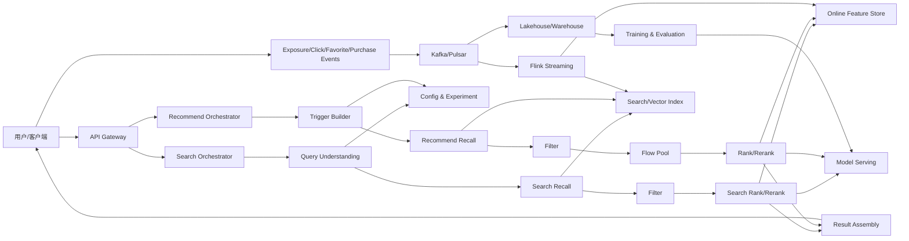
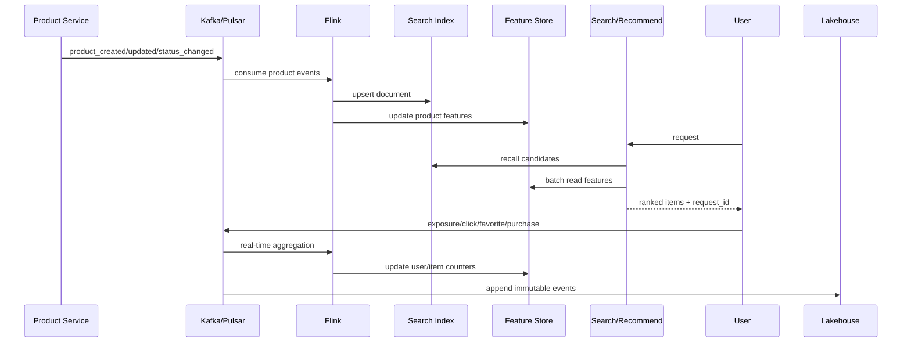

# Legacy 搜推课程：墨圆电商搜索、推荐与 Agent 技术报告

> **Legacy 教材**：本报告记录早期搜索推荐课程与二手业务案例，不代表墨圆智选当前产品架构。当前主线见 [Moyuan SAR Agent V2](./code/agent-control-plane/README.md)。

## 1. 报告范围

本报告以墨圆自有教学平台为背景，描述一套使用合成数据的二手电商搜索与推荐教学系统，覆盖：

- 搜索与推荐的业务目标、领域对象和阶段契约。
- Query 理解、多路召回、过滤、特征、粗排、精排和列表重排。
- 推荐流量池、曝光治理、反馈闭环和多目标优化。
- 配置、实验、可观测性、服务化、容器化与 Kubernetes。
- 购买决策搜推 Agent、ModelPort、Grounding、安全、Trace 和离线评测。
- 从内存教学实现演进到生产平台的替换边界。

课程中的系统设计分为三层：

1. **稳定原理**：候选漏斗、召回率与精度权衡、特征一致性、实验隔离、失败降级。
2. **参考架构**：统一 `Candidate`、显式 Pipeline、Trace、配置控制平面和事件闭环。
3. **教学实现**：使用小规模商品数据和启发式 pCTR/pCVR，使全部链路可以在本机运行和验证。

示例权重、流量比例、延迟预算和资源值用于教学与容量规划起步，不应直接视为生产默认值。

墨圆质选、回收估价、寄卖和仓店履约专题见[第 13 章](./chapters/13-moyuan-secondhand-business-case.md)。其中购买决策是主线，回收、寄卖和门店是可选模拟扩展，不描述任何真实公司的内部实现。

## 2. 一句话结论

搜索和推荐并不是两个完全不同的系统。它们共享商品、用户、特征、模型、实验、日志和平台能力，核心差异只在于：

- 搜索从用户显式 Query 出发，首要目标是相关性和约束满足。
- 推荐从用户、场景和上下文触发，首要目标是兴趣匹配、发现性和长期收益。

成熟系统的技术骨架都可以表达为：

```text
请求/上下文
  -> 理解与触发
  -> 多路召回
  -> 硬过滤
  -> 低成本粗排
  -> 资源/流量分配
  -> 高成本精排
  -> 模型或规则重排
  -> 结果组装
  -> 曝光/点击/交易反馈
```

## 3. 系统全景



### 3.1 在线平面

在线平面负责毫秒级返回结果。它必须有明确的超时预算、并行策略、降级策略和候选上限。典型预算可按以下方式起步：

| 阶段 | 搜索预算 | 推荐预算 | 超时后的处理 |
|---|---:|---:|---|
| 请求校验/理解 | 10 ms | 8 ms | 使用原 Query/默认上下文 |
| 多路召回 | 60 ms | 70 ms | 保留已完成召回，热门兜底 |
| 过滤/特征 | 20 ms | 25 ms | 关键硬过滤不可跳过，弱特征给默认值 |
| 粗排/流量池 | 15 ms | 20 ms | 退化为静态分数或固定配额 |
| 精排 | 45 ms | 50 ms | 退化到粗排顺序 |
| 重排/组装 | 15 ms | 15 ms | 跳过模型重排，保留规则安全约束 |

这些数字是容量规划的起始示例。生产值必须用压测和实际依赖 P99 校准。

### 3.2 数据平面

数据平面负责：

- 商品状态和属性进入搜索索引。
- 曝光、点击、收藏、咨询、下单、支付进入事件流。
- 实时特征由流处理更新，离线特征和训练样本进入湖仓。
- 模型经过训练、离线评估、回放、灰度和线上 AB 后发布。
- 实验、策略和配置变化可审计、可回滚。

### 3.3 控制平面

控制平面决定“哪一套链路、哪些参数、哪个模型”处理本次请求：

- 场景配置：主页、详情页、搜索页、同城页。
- Pipeline 配置：阶段、组件、执行顺序和条件。
- AB 配置：分层、分桶、实验版本、参数覆盖。
- 模型配置：模型版本、特征版本、超时、降级版本。
- 运营配置：置顶、屏蔽、类目配额、活动规则。

## 4. 搜索系统技术报告

### 4.1 搜索链路

搜索的逻辑主链路可归纳为六个核心阶段：

```text
Query 理解
  -> 召回
  -> 特征准备
  -> 排序
  -> 重排
  -> 响应组装
```

主链路前还可能有质检码直查、无库存图书兜底、同城 Tab 转换等特殊路径。生产设计应把这些路径显式建模为前置路由，不要散落在排序代码中。

### 4.2 Query 理解

Query 理解回答五个问题：

1. 这个请求能否搜索，是否触发安全或风控规则？
2. 用户输入的规范形式是什么？
3. 是否有拼写错误、同义表达或别名？
4. 用户想找哪个类目、品牌、型号、属性和价格带？
5. 这是精确 Query 还是泛 Query？

教学实现位于 `code/src/shoprec/text.py`：

```text
normalize
  -> correction
  -> synonym rewrite
  -> category/brand intent
  -> risk detection
  -> broad-query decision
```

泛 Query 的核心不是“字数短”，而是“缺乏精确信号且存在泛类目证据”。更稳健的判定顺序是：

1. 否决关：品牌、型号、数字规格、强属性是否已经足够具体。
2. 确认关：是否命中运营词典、类目词典或泛词模型。
3. 默认关：证据不足按精确 Query 处理，防止错误扩召回。

### 4.3 多路召回

召回追求覆盖率，常见通道包括：

| 召回通道 | 适用场景 | 主要风险 |
|---|---|---|
| 词法/BM25 | 明确关键词 | 同义词和语义表达覆盖不足 |
| 类目/属性 | Query 已解析出结构化意图 | 意图识别错误会扩散 |
| 品牌/型号 | 精确商品意图 | 词典维护成本 |
| 向量语义 | 长尾、自然语言、图文 | 延迟、误召回、向量版本一致性 |
| 泛词探索 | 类目泛词需要有限发现性 | 扩召回过强会降低相关性 |
| 热门兜底 | 无结果或弱 Query | 个性化不足、头部固化 |
| 商业/活动 | 活动场景 | 破坏相关性和用户信任 |

多路结果必须按 `product_id` 去重，同时保留 `recall_sources`。来源不是只为调试，它本身也是排序特征和配额依据。

教学实现将泛词探索标记为 `broad_explore`，只在已确认的泛 Query 中补充少量相关类目的高质量候选；只有词法、类目和品牌均为空时才触发 `hot_fallback`。两者必须分开观测，避免把策略探索误当作无结果兜底。

### 4.4 硬过滤

过滤处理不能违反的业务约束：

- 下架、售罄、删除、风控商品。
- 类目、品牌、价格、城市、成色等用户筛选条件。
- 卖家黑名单和内容安全。
- 业务线或场景不可见规则。

每次过滤都要写理由码。只记录“召回 500，过滤后 80”无法解释为何少了 420 条；记录 `out_of_stock=120`、`city_mismatch=260`、`risk=40` 才能排障。

### 4.5 粗排

粗排的目标是用低成本特征从数百/数千候选缩小到精排可承受的规模。教学版使用：

```text
rough_score =
    0.45 * lexical
  + 0.25 * intent
  + 0.15 * source_strength
  + 0.10 * quality
  + 0.05 * trust
```

生产中可以从线性模型升级到 LR、GBDT、轻量 DNN 或蒸馏模型，但必须控制：

- 单候选特征读取量。
- 模型推理批量大小。
- 候选上限和超时。
- 粗排召回率，即精排优质商品是否在粗排阶段被误删。

### 4.6 精排

搜索精排通常同时优化：

- 文本/语义相关性。
- 类目、品牌和属性意图匹配。
- 质量、时效性和库存健康。
- pCTR、pCVR 或交易价值。
- 用户兴趣和地域偏好。

教学版把权重放进 AB 实验参数。生产系统应将模型版本和特征 schema 绑定，避免模型拿到错误口径的同名特征。

### 4.7 重排

重排负责列表级约束，单商品分数无法表达：

- 同类目、同品牌、同卖家不要连续霸屏。
- 泛 Query 前若干位需要强相关商品。
- 活动商品占比和广告隔离。
- 新鲜商品、探索商品需要有限曝光。
- 结果需要满足安全、合规和库存最终校验。

教学版使用贪心算法：每轮选择“原始分数减重复惩罚”最高的候选，并限制同卖家数量。生产中可使用规则 DSL、MMR、约束优化或强化学习。

### 4.8 排序模式

电商搜索通常包括综合、活动综合、价格升序、价格降序、最新发布、距离最近等模式。实现时应区分：

- `relevance`：完整模型排序与重排。
- `price_asc/desc`：过滤仍保留，最终主键改为价格；相关性可作为最低门槛或次级键。
- `newest`：时间主排序，但仍需去除低质量/不相关商品。
- `distance`：需要地理坐标、距离计算和位置权限。

## 5. 推荐系统技术报告

### 5.1 十阶段主链路

本课程采用以下推荐工程主链路：

```text
入口
  -> QUERY
  -> RECALL
  -> FILTER
  -> ROUGHRANK
  -> FLOWPOOL
  -> RANK
  -> 模型 RERANK
  -> 规则 RERANK
  -> RESULT
```

其中入口服务承担参数解析与中央编排；召回服务内部又包含触发器、召回器、归并、补量和过滤；排序服务承担特征与多模型打分；策略模块做列表级规则。

### 5.2 QUERY 与触发器

推荐的 QUERY 并非文本 Query，而是请求上下文预处理：

- 加载场景配置。
- 补充 AB 信息。
- 解析用户、设备、城市、入口和会话。
- 生成用户标签和实时兴趣。
- 决定本次启用哪些召回、模型和策略。

触发器把上下文变成召回器可消费的种子：

- 用户兴趣类目。
- 最近点击/收藏/购买商品。
- 搜索 Query 或会话主题。
- 地理位置和时间。
- 当前详情页商品。

触发器不直接返回推荐结果；它决定“从哪里找相似或相关商品”。

### 5.3 多路召回

教学实现提供四路：

| 来源 | 逻辑 | 生产替换 |
|---|---|---|
| `interest` | 用户高兴趣类目商品 | 用户画像 + 倒排索引 |
| `item_cf` | 与最近点击同类目/品牌 | ItemCF/图召回/向量 ANN |
| `hot` | CTR×CVR×质量较高 | 分场景热门榜 |
| `fresh` | 新发布商品 | 时间索引 + 质量门槛 |

成熟推荐还会增加双塔向量召回、UserCF、搜索行为召回、关注卖家、地理附近、价格带、图文多模态和运营召回。

### 5.4 过滤

推荐过滤通常比搜索多出用户历史约束：

- 已曝光、已点击、已购买。
- 用户明确不喜欢。
- 卖家/商品频控。
- 相似商品去重和 SPU 去重。
- 内容安全、库存和场景适配。

过滤需要在多个位置执行：召回后做大规模过滤，结果前再做最终状态校验。后一次校验用于防止在线状态在处理期间变化。

### 5.5 粗排

一个便于理解正负反馈组合的粗排表达为：

```text
rough_score = pos * (1 - neg) + rate
```

它体现了“正反馈、负反馈、先验率”的组合思路。教学版使用兴趣、Item 相似度、质量、新鲜度、pCTR/pCVR 的线性组合，目的相同：在较低成本下保住最有希望的候选。

### 5.6 Flow Pool

Flow Pool 是推荐链路中很重要、也很容易被初学者忽略的一层。它把候选按业务意图划分成池，再按配额分配：

- `interest`：稳定满足已知兴趣。
- `explore`：探索新类目、新品牌和长尾。
- `fresh`：扶持高质量新发布。

没有流量池，所有候选只按一个分数竞争，热门和强兴趣会持续挤压探索与新鲜内容，系统短期 CTR 可能不错，长期生态会变差。

教学版的配额属于 `recommend_flowpool` 实验层：

```json
{
  "control": {"interest": 0.60, "explore": 0.25, "fresh": 0.15},
  "explore_more": {"interest": 0.35, "explore": 0.40, "fresh": 0.25}
}
```

教学实现会把比例转换成总和严格等于页面大小的整数目标，并在规则重排中真正执行。响应同时返回 `pool_targets` 与 `pool_counts`，可以区分策略目标和候选不足后的实际结果。

### 5.7 精排与多目标

推荐精排可使用：

```text
utility =
    w1 * pCTR
  + w2 * pCVR
  + w3 * value
  + w4 * quality
  + w5 * long_term_value
  - penalties
```

不要直接把概率相加而不做校准。pCTR 和 pCVR 的量纲、分布与训练样本不同，生产系统常用乘法、分段函数、校准后加权或多任务模型。

### 5.8 两层重排

推荐链路应显式区分模型重排和规则重排：

- 模型重排：输入一个列表，学习上下文、位置和商品间关系；失败时保留精排顺序。
- 规则重排：使用策略框架/DSL 实现类目打散、卖家频控、业务配额、插入与保序。

这个顺序很重要。先让模型优化列表收益，再让规则保证业务硬约束；但安全规则必须在任何模型前后都保持不可绕过。

### 5.9 结果与曝光

返回前需要：

- 收集模型与策略特征。
- 组装商品展示结构。
- 写入曝光去重集合。
- 输出 Trace、实验版本和必要的解释字段。

曝光记录应有 TTL 和场景维度。永久去重会让候选枯竭；完全不去重会让用户反复看到相同商品。

## 6. 搜索和推荐的公共能力

| 能力 | 搜索 | 推荐 | 应否平台化 |
|---|---|---|---|
| 商品索引 | 词法、过滤、向量 | 向量、倒排、状态 | 是 |
| 用户画像 | 个性化排序 | 触发、召回、排序 | 是 |
| 特征平台 | 相关性和行为特征 | 用户/商品/交叉特征 | 是 |
| 模型服务 | 粗排、精排、重排 | 粗排、精排、重排 | 是 |
| AB 平台 | Query/召回/排序实验 | 召回/流量池/排序实验 | 是 |
| 配置平台 | 词典、路由、权重 | 场景、Pipeline、配额 | 是 |
| Debug 平台 | Query、召回、过滤、排序 | 全十阶段 | 是 |
| 事件平台 | 搜索、点击、转化 | 曝光、反馈、交易 | 是 |

平台化不是把所有逻辑塞进一个“大平台服务”。正确做法是统一契约和基础能力，业务策略仍由对应领域团队维护。

## 7. 特征体系

### 7.1 特征分类

| 类型 | 示例 | 更新频率 |
|---|---|---|
| Query | 长度、词性、类目意图、泛词 | 请求级 |
| 用户 | 类目兴趣、价格偏好、城市 | 分钟到天 |
| 商品 | 品牌、成色、质量、年龄 | 秒到天 |
| 交叉 | Query-标题相关性、用户-类目兴趣 | 请求级 |
| 上下文 | 时间、入口、设备、位置 | 请求级 |
| 统计 | CTR、CVR、销量、负反馈率 | 分钟到天 |
| 图/向量 | 用户向量、商品向量、相似度 | 分钟到天 |

### 7.2 训练与推理一致性

最常见的模型事故不是网络结构，而是特征不一致：

- 训练按 UTC 日切，在线按本地时间。
- 离线缺失值为 0，在线缺失值为 -1。
- 训练用了曝光时快照，在线读取了未来更新值。
- 类目字典和 embedding 版本不同。
- 同名 `ctr_7d` 实际窗口不同。

每个特征必须有 owner、数据类型、缺失值、时间语义、窗口、版本和血缘。

### 7.3 特征泄漏

训练样本只能使用曝光当时可见的数据。支付后才生成的信息不能回填到曝光时特征，否则离线指标很好、线上效果很差。

## 8. 数据、索引和反馈闭环



核心数据契约应至少包含：

- `event_id`：幂等去重。
- `request_id`：关联一次请求的所有阶段。
- `user_id/device_id/session_id`：在合规约束下关联行为。
- `product_id`、`scene`、`position`。
- `event_time` 和 `ingest_time`：处理迟到和乱序。
- `experiment_assignments`：正确归因实验效果。
- `model_version`、`strategy_version`。

索引更新需要处理乱序。用商品业务版本或更新时间做 compare-and-set，防止旧的“在售”事件覆盖新的“已售”事件。

## 9. AB 实验和配置

### 9.1 稳定分桶

教学实现使用：

```text
bucket = sha256(layer + ":" + token) % 100
```

同一个用户在同一层稳定命中同一版本，不同层使用不同盐，避免相互绑定。

### 9.2 分层

推荐的典型层级可以是：

```text
root
  -> recall_root
      -> recall
      -> roughrank
      -> flowpool
  -> rank_root
      -> features
      -> ctr
      -> cvr
  -> strategy
```

同层实验互斥，跨层实验可以正交。若两个实验强交互，应放入联合实验或分析交互项。

### 9.3 配置发布

每次配置变更必须带：

- 版本号和变更人。
- schema 校验。
- 预发布/影子校验。
- 灰度比例。
- 业务与系统指标守护。
- 一键回滚版本。

## 10. Debug 与可观测性

一次请求需要三类视图：

1. **Trace**：阶段耗时、调用树、超时和错误。
2. **数量漏斗**：每阶段输入/输出数量。
3. **决策解释**：召回来源、过滤理由、特征、模型分和策略动作。

教学响应示例：

```json
{
  "recall_sources": ["brand_intent", "category_intent", "lexical"],
  "features": {
    "lexical": 1.0,
    "intent": 1.0,
    "quality": 0.95,
    "pctr": 0.56
  },
  "scores": {
    "rough": 0.99,
    "rank": 0.86
  }
}
```

推荐排障顺序：

```text
参数与实验
  -> Query/触发器
  -> 各召回源数量
  -> 合并去重
  -> 各过滤理由
  -> 特征缺失率
  -> 粗排截断
  -> 模型分布
  -> 流量池配额
  -> 重排动作
  -> 最终状态校验
```

空结果不应立即归咎于召回。常见原因是召回有结果但被库存、城市、历史曝光或错误配置全部过滤。

## 11. 稳定性和降级

| 故障 | 正常策略 | 降级策略 |
|---|---|---|
| Query 服务超时 | 纠错、意图、向量 | 原 Query + 词法召回 |
| 向量召回超时 | ANN 候选 | 词法/热门召回 |
| 用户画像失败 | 个性化特征 | 匿名热门和上下文 |
| 特征库超时 | 完整在线特征 | 默认值/本地缓存/静态特征 |
| 粗排模型失败 | 模型分 | 规则线性分 |
| 精排模型失败 | 多目标模型 | 粗排顺序 |
| 模型重排失败 | 列表模型 | 保留精排顺序 |
| 配置中心异常 | 最新配置 | 本地最近成功快照 |
| 曝光写入失败 | 强去重 | 异步补写，不阻塞主响应 |

需要同时防止“降级风暴”：依赖已经异常时继续高频重试会加剧故障。应使用超时、隔离、熔断、限流和有抖动的退避。

## 12. 容量和性能

候选数对成本近似呈以下关系：

```text
召回 I/O 成本 ≈ 召回路数 × 单路查询成本
特征成本 ≈ 候选数 × 特征数
模型成本 ≈ 候选数 × 单样本推理成本
重排成本 ≈ 列表长度 × 约束/模型复杂度
```

所以链路中要有明确漏斗：

```text
召回 2000
  -> 过滤 1200
  -> 粗排 400
  -> Flow Pool 200
  -> 精排 100
  -> 重排并返回 20
```

实际数值按场景设置。监控不仅看最终 P99，还要看每阶段候选数分位数；配置错误使候选翻倍时，延迟往往先悄悄恶化。

## 13. 教学代码与生产组件映射

| 代码 | 具体逻辑 | 生产系统位置 |
|---|---|---|
| `models.py` | 请求、商品、候选、响应契约 | RPC/HTTP Proto、领域 DTO |
| `text.py` | Query 归一化、改写、意图、泛词 | Query Understanding 服务 |
| `search.py` | 搜索编排和各阶段漏斗 | Search Orchestrator/Recall |
| `recommend.py` | 推荐十阶段主干 | Recommend Orchestrator |
| `ranking.py` | 特征、打分、列表重排 | Feature/Rank/Rerank 服务 |
| `experiments.py` | 稳定分桶和参数覆盖 | AB 平台 SDK |
| `observability.py` | 阶段 Trace 和理由码 | Debug/Tracing 平台 |
| `valuation.py` | 二手设备预估价和风险解释 | 设备识别/估价/质检工作流 |
| `service.py` | 应用门面、事件反馈 | Application Service |
| `server.py` | HTTP 适配器 | API/RPC Adapter |
| `sample_data.py` | 商品和画像 | ES、Redis、Feature Store |

## 14. 关键工程判断

### 14.1 召回来源必须保留

同一商品可能同时由词法、类目和向量召回命中。合并时只留下商品、不留下来源，会丢失：

- 多路一致性信号。
- 召回源效果归因。
- 召回配额和问题定位。

### 14.2 过滤理由必须结构化

不要只写自由文本日志。理由码需要枚举化并带计数，才能做监控、趋势、告警和回放。

### 14.3 排序分数不是最终顺序

精排优化单点效用，重排优化列表效用和业务约束。把所有约束强塞进单点模型会难训练、难解释、难快速配置。

### 14.4 配置是代码的一部分

Pipeline、实验、模型和策略配置可以在不发版时改变核心行为，因此也必须经过 review、测试、灰度、审计和回滚。

### 14.5 Debug 是产品能力

成熟搜推系统没有请求级 Debug 就很难维护。Debug 需要在框架层统一，而不是让每个组件随意打印日志。

## 15. 从教学版到生产版

推荐按四个阶段推进：

| 阶段 | 目标 | 关键产物 |
|---|---|---|
| 1. 可用 MVP | 搜得到、推得出、可解释 | API、词法召回、热门推荐、规则排序、事件埋点 |
| 2. 数据闭环 | 可训练、可评估 | Kafka/Flink、湖仓、样本、基础特征、离线评估 |
| 3. 模型化 | 提升效果 | 向量召回、粗排/精排模型、在线特征、模型服务、AB |
| 4. 平台化 | 提升迭代效率和稳定性 | Pipeline、配置、Debug、模型注册、自动灰度、成本治理 |

每个阶段都要以“可观测、可回滚、可归因”为完成条件，而不是仅以功能上线为完成。

## 16. 报告结论

整套系统可以归纳为四个工程思想：

1. 用 Pipeline 和候选漏斗管理复杂链路。
2. 用召回来源、过滤理由、特征和分数解释每个结果。
3. 用实验与配置把快速迭代控制在可审计、可回滚的边界内。
4. 用数据闭环和平台能力让搜索与推荐持续进化。

完整代码逐段讲解、练习和生产迁移方案见本目录各章节。
## 17. 搜推 Agent Part II 补充

课程在原有搜索与推荐 Pipeline 之上增加一个有界的 iPhone 购买决策 Agent，而不是新增一个与搜推无关的品牌聊天机器人。Agent 复用搜索、推荐和反馈 API，增加需求状态、硬/软约束、Grounding、显式确认、候选清单、Trace 和离线评测。

主工作流限制为 6 轮、5 次工具调用、每轮一个工具、最多 3 个候选。默认 `ReplayModel` 使 CI 完全离线；真实模型只经过 Linux 中的外部 ModelPort `/v1/chat/completions` 和逻辑别名 `moyuan-shoprec-agent`。Provider 路由、配额与内部重试属于 ModelPort，业务状态、证据和写确认属于 Agent。

配套资产包括 200 条合成 iPhone 商品、60 条正常任务、20 条失败恢复和 20 条安全评测，以及一个高级只读搜推诊断 Agent。详细设计见第 14–18 章。
